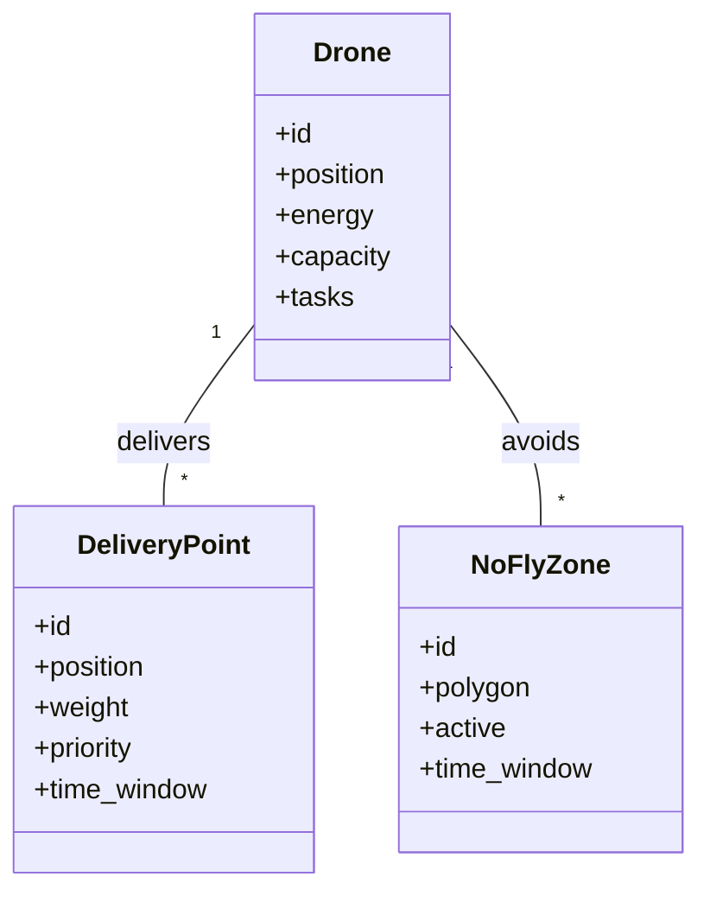

# Drone Filo Optimizasyonu: Sistem Mimarisi ve Genişletilmiş Açıklama

## 1. Genel Bakış

Bu sistem, dinamik kısıtlar altında çalışan drone filoları için teslimat rotalarını optimize eden, modüler ve genişletilebilir bir yazılım altyapısı sunar. Genetik Algoritma (GA), A* yol bulma ve Kısıt Programlama (CSP) teknikleri entegre edilmiştir.

---

## 2. Modül ve Dosya Yapısı

```
drone_takip_py/
├── src/
│   ├── __init__.py
│   ├── main.py
│   ├── run_system.py
│   ├── data_generator.py
│   ├── models.py
│   ├── visualization.py
│   ├── results.json
│   ├── scenario_1_results.html
│   ├── scenario_2_results.html
│   ├── test_scenario.py
│   └── algorithms/
│       ├── __init__.py
│       ├── genetic_algorithm.py
│       └── path_planning.py
│   └── tests/
│       ├── __init__.py
│       ├── conftest.py
│       ├── test_algorithms.py
│       ├── test_genetic_algorithm.py
│       ├── test_models.py
│       ├── test_models_and_generator.py
│       └── test_scenarios.py
├── requirements.txt
├── setup.py
├── README.md
├── ARCHITECTURE.md
├── project_plan.md
└── ...
```

---

## 3. Modüllerin Detaylı Açıklamaları

### 3.1. `main.py`
- Programın giriş noktasıdır.
- Senaryo yönetimi, veri yükleme ve genel akış burada başlatılır.

### 3.2. `models.py`
- Temel veri yapıları:
  - **Drone**: Konum, enerji, kapasite, görev listesi.
  - **DeliveryPoint**: Konum, ağırlık, öncelik, zaman penceresi.
  - **NoFlyZone**: Çokgen koordinatları, aktiflik durumu, zaman aralığı.

### 3.3. `data_generator.py`
- Test ve senaryo bazlı veri üretimi sağlar.
- Rastgele veya belirli parametrelerle drone, teslimat noktası ve no-fly zone üretir.

### 3.4. `algorithms/`
- **genetic_algorithm.py**: Rota ve görev atama için GA motoru.
- **path_planning.py**: A* algoritması ile yol bulma.
- CSP entegrasyonu için genişletilebilir yapı.

### 3.5. `visualization.py`
- Folium ile harita tabanlı görselleştirme.
- Matplotlib ile performans grafikleri.

### 3.6. `run_system.py`
- Alternatif ana program.
- HTML rapor üretimi ve toplu senaryo çalıştırma.

### 3.7. `tests/`
- Pytest tabanlı birim ve entegrasyon testleri.

---

## 4. Veri Akışı ve İşleyiş

```mermaid
flowchart TD
    A[Veri Üretimi] --> B[Graf Modelleme]
    B --> C[Optimizasyon (GA + A* + CSP)]
    C --> D[Kısıt Kontrolü]
    D --> E[Görselleştirme & Raporlama]
```

---

## 5. Sınıf Diyagramı (Özet)



---

## 6. Algoritma Entegrasyonu

- **Genetik Algoritma**: Rota ve görev atama için ana optimizasyon motoru.
- **A\***: Drone’ların iki nokta arasında en kısa ve güvenli yolu bulması için kullanılır.
- **CSP**: Zaman penceresi, enerji ve no-fly zone kısıtlarının ihlal edilmemesi için çözümleyici olarak entegre edilir.

---

## 7. Genişletilebilirlik ve Esneklik

- **Yeni Kısıtlar**: `models.py` ve algoritma modülleri kolayca yeni kısıtlarla genişletilebilir.
- **Farklı Optimizasyon Teknikleri**: Algoritma modülleri yeni meta-sezgisel veya deterministik yöntemlerle genişletilebilir.
- **Senaryo Yönetimi**: `data_generator.py` ve `run_system.py` üzerinden yeni test senaryoları eklenebilir.
- **Görselleştirme**: Harita ve grafik modülleri farklı kütüphanelerle entegre edilebilir.

---

## 8. Test ve Değerlendirme

- **Senaryo 1**: Temel stabilite ve performans testi.
- **Senaryo 2**: Ölçeklenebilirlik ve dinamik adaptasyon testi.
- **Değerlendirme Metrikleri**: Tamamlanma oranı, enerji verimliliği, algoritma süresi, kısıt ihlali.

---

## 9. Kullanım ve Kurulum

- Python 3.8+ gereklidir.
- `requirements.txt` ile bağımlılıklar yüklenir.
- Komut satırı veya programatik olarak çalıştırılabilir.
- Sonuçlar HTML ve JSON olarak kaydedilir.

---

## 10. Geliştirme ve Katkı

- Kod tabanı modülerdir ve testlerle desteklenmiştir.
- Geliştiriciler yeni algoritmalar, kısıtlar veya görselleştirme araçları ekleyebilir.
- Detaylı dökümantasyon ve örnekler için `README.md` ve `project_plan.md` dosyalarına bakınız.

---

## 11. Referanslar

- Genetic Algorithm, A* Pathfinding, Folium, NetworkX, NumPy, SciPy, Matplotlib, Python 3.8+ dökümantasyonları.

---

**Son Güncelleme:** 29 Mayıs 2025  
**Versiyon:** 1.0.0  
**Python Uyumluluğu:** 3.8+

---

## Proje Raporu

### 1. Proje Özeti

Bu proje, enerji limitleri ve uçuş yasağı bölgeleri (no-fly zones) gibi dinamik kısıtlar altında çalışan drone filolarının teslimat rotalarını optimize eden hibrit bir algoritma sistemi geliştirmeyi amaçlamaktadır. Sistem, Genetik Algoritma (GA), A* yol bulma algoritması ve Kısıt Programlama (CSP) çözücüsünü entegre ederek çok kriterli optimizasyon sağlar. Proje, gerçek zamanlı adaptasyon, çoklu kriter optimizasyonu ve dinamik kısıt yönetimiyle literatürdeki klasik yaklaşımlara kıyasla daha esnek ve güçlü bir çözüm sunar.

### 2. Problem Tanımı ve Motivasyon

E-ticaret ve lojistik sektörlerinde son mil teslimat maliyetlerinin artması, drone tabanlı teslimat sistemlerinin önemini artırmıştır. Ancak, bu sistemlerde:

- Dinamik No-Fly Zones: Zamanla değişen uçuş yasağı bölgeleri,
- Enerji Kısıtları: Batarya kapasitesi ve şarj süreleri,
- Çoklu Kriterler: Mesafe, ağırlık, öncelik ve zaman penceresi,
- Gerçek Zamanlı Adaptasyon: Çevresel değişikliklere hızlı yanıt gereksinimi,

gibi zorluklar klasik optimizasyon yöntemleriyle yeterince çözülememektedir.

### 3. Sistem Mimarisi ve Genel İşleyiş

#### 3.1. Modül Yapısı

- main.py: Programın giriş noktası, senaryo yönetimi ve genel akış.
- src/models.py: Temel veri yapıları (Drone, DeliveryPoint, NoFlyZone).
- data_generator.py: Test verisi üretici (senaryo bazlı).
- src/algorithms/genetic_algorithm.py: Genetik algoritma motoru.
- src/algorithms/path_planning.py: A* yol bulma algoritması.
- visualization.py: Harita ve grafik görselleştirme.
- run_system.py: Alternatif ana program ve HTML rapor üretimi.

#### 3.2. Akış Diyagramı

Veri Üretimi → Graf Modelleme → Optimizasyon (GA + A* + CSP) → Kısıt Kontrolü → Görselleştirme & Raporlama

#### 3.3. İşleyiş Özeti

- Veri Üretimi: Senaryoya uygun drone, teslimat noktası ve no-fly zone verileri üretilir.
- Graf Modelleme: Teslimat noktaları ve drone hareketleri yönlü graf olarak modellenir.
- Optimizasyon: Genetik Algoritma, A* ve CSP ile rota ve atama optimizasyonu yapılır.
- Kısıt Kontrolü: Enerji, zaman penceresi ve no-fly zone kısıtları kontrol edilir.
- Görselleştirme: Sonuçlar interaktif harita ve HTML rapor olarak sunulur.

### 4. Veri Yapıları

- Drone Sınıfı
- Teslimat Noktası Sınıfı
- No-Fly Zone Sınıfı

### 5. Algoritmalar ve Optimizasyon Teknikleri

#### 5.1. Graf Modellemesi

- Düğümler (V): Depo ve teslimat noktaları.
- Kenarlar (E): Drone hareketleri.
- Ağırlıklar (W): Maliyet fonksiyonu.

#### 5.2. Maliyet Fonksiyonu

- distance: İki nokta arası öklidyen mesafe.
- weight: Taşınan paket ağırlığı.
- priority: Teslimat öncelik seviyesi (1-5).

#### 5.3. A* Heuristik Fonksiyonu

- g(n): Başlangıçtan n'e olan gerçek maliyet.
- h(n): n'den hedefe tahmini maliyet.
- no_fly_penalty: Yasak bölge ceza katsayısı.

#### 5.4. Genetik Algoritma Parametreleri

- Popülasyon Boyutu: 100
- Jenerasyon Sayısı: 50
- Mutasyon Oranı: 0.25
- Çaprazlama Oranı: 0.8
- Elitizm Sayısı: 5
- Turnuva Seçim Boyutu: 3

**Fitness Fonksiyonu ve Operatörler:**
- Çaprazlama: Order crossover (OX)
- Mutasyon: Swap ve insert mutation
- Seçim: Tournament selection
- Elitizm: En iyi %5'in korunması

#### 5.5. CSP (Constraint Programming)

Zaman penceresi, enerji ve no-fly zone kısıtlarının çözümde ihlal edilmemesi için kullanılır.

### 6. Deneysel Kurulum ve Test Senaryoları

#### 6.1. Senaryo 1: Temel Test

- Drone Sayısı: 5
- Teslimat Sayısı: 20
- No-Fly Zone: 2 statik bölge
- Hedef: Algoritma stabilitesi ve temel performans

#### 6.2. Senaryo 2: Karmaşık Test

- Drone Sayısı: 10
- Teslimat Sayısı: 50
- No-Fly Zone: 5 dinamik bölge
- Hedef: Ölçeklenebilirlik ve dinamik adaptasyon

#### 6.3. Değerlendirme Metrikleri

| Metrik            | Açıklama                        | Hedef      |
|-------------------|---------------------------------|------------|
| Completion Rate   | Tamamlanan teslimat yüzdesi     | > %80      |
| Energy Efficiency | Ortalama enerji tüketimi (mAh)  | < 500 mAh  |
| Execution Time    | Algoritma çalışma süresi        | < 60 sn    |
| Rule Violations   | Kısıt ihlal sayısı              | 0          |

### 7. Sonuçlar ve Analiz

#### 7.1. Performans Sonuçları

| Senaryo | Teslimat | Tamamlanan | Başarım (%) | Toplam Mesafe (km) | Ortalama Enerji (mAh) | Süre (sn) |
|---------|----------|------------|-------------|--------------------|-----------------------|-----------|
| 1       | 20       | 3          | 15.0        | 16.7               | 200.0                 | 12.2      |
| 2       | 50       | 0          | 0.0         | 0.0                | 0.0                   | 7.4       |

- **Senaryo 1 Sonuçları**
  - Algoritma Stabilitesi: GA başarıyla çalıştı.
  - Düşük Başarım: %15 tamamlanma oranı, optimizasyon gerektiriyor.
  - Enerji Verimliliği: 200 mAh/teslimat makul.
  - Çalışma Süresi: 12.2 saniye.

- **Senaryo 2 Sonuçları**
  - Başarım Sorunu: Hiç teslimat tamamlanamadı.
  - Analiz Gerekli: Karmaşık kısıtlar algoritma performansını etkiledi.
  - Hızlı Sonlandırma: 7.4 saniye.

#### 7.2. Zaman Karmaşıklığı Analizi

- Genetik Algoritma: O(P × G × N²) = O(100 × 50 × 20²) = O(2×10⁶)
- A* Algoritması: O(b^d) - ortalama O(N log N)
- Graf Oluşturma: O(N²)

#### 7.3. Optimizasyon Önerileri

- Fitness fonksiyonu ağırlıklarının ayarlanması.
- GA ve A* entegrasyonunun güçlendirilmesi.
- Başlangıç çözümü için geçici kısıt esnekliği.
- Multi-objective optimization (Pareto frontier).

### 8. Kurulum ve Kullanım

#### 8.1. Sistem Gereksinimleri

- Python: 3.8+
- İşletim Sistemi: Windows 10/11, macOS, Linux
- RAM: Minimum 4GB (8GB önerilen)
- Disk Alanı: 500MB

#### 8.2. Kurulum Adımları

- `requirements.txt` ile bağımlılıkların yüklenmesi.
- Komut satırı veya programatik kullanım.
- Parametre konfigürasyonu ile esnek senaryo yönetimi.

### 9. Görselleştirme

- Folium tabanlı interaktif haritalar: Drone rotaları, teslimat noktaları, no-fly zones.
- Performans grafikleri: Matplotlib ile jenerasyon başına başarı, enerji dağılımı, süre analizi.
- HTML raporları: scenario_1_results.html, scenario_2_results.html

### 10. Proje Yönetimi ve Geliştirme Süreci

#### 10.1. Geliştirme Aşamaları

- Temel Altyapı: Veri yapıları ve test veri üretimi.
- Algoritma Geliştirme: A*, GA ve CSP implementasyonu.
- Optimizasyon ve Test: Performans iyileştirme, test senaryoları.
- Görselleştirme ve Dokümantasyon: Harita arayüzü, istatistikler, dökümantasyon.

#### 10.2. Teknoloji Yığını

- Python 3.8+
- numpy, networkx, scipy, folium, matplotlib
- pytest, black

### 11. Referanslar

- Genetic Algorithm
- A* Pathfinding
- Folium Visualization
- NetworkX Documentation
- Folium Documentation
- NumPy User Guide
- SciPy Optimization
- Python 3.8+ Documentation

### 12. Sonuç ve Değerlendirme

Bu proje, dinamik kısıtlar altında çalışan drone filoları için esnek, ölçeklenebilir ve görselleştirilebilir bir optimizasyon altyapısı sunmaktadır. Kod tabanı modülerdir, test edilebilir ve genişletilebilir yapıdadır. Deneysel sonuçlar, temel senaryoda algoritmanın çalıştığını, ancak karmaşık senaryolarda daha ileri optimizasyona ihtiyaç olduğunu göstermektedir. Proje, akademik ve endüstriyel uygulamalar için güçlü bir temel teşkil etmektedir.

---
