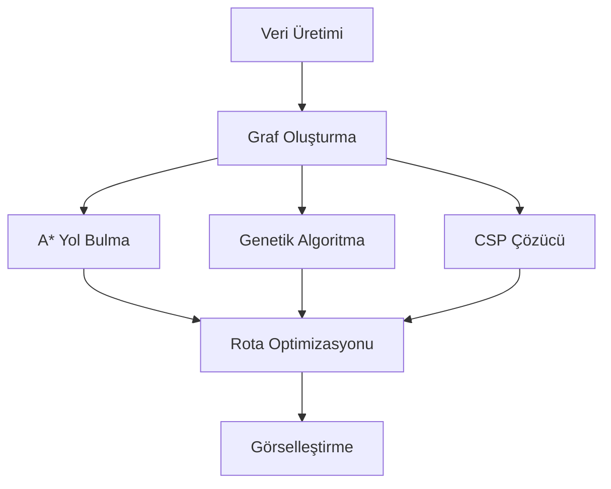

# Drone Filo Optimizasyonu - README Dokümantasyon Planı

## 📋 Genel Bakış
Bu doküman, Drone Filo Optimizasyonu projesi için IEEE uyumlu README dosyasının oluşturulması için hazırlanmış detaylı plandır.

## 🎯 Hedef
GitHub proje teslim kriterlerine uygun, IEEE konferans formatında teknik detayları içeren, profesyonel bir README dokümantasyonu oluşturmak.

## 📖 README Yapısı

### 1. 📋 Başlık ve Tanıtım
- **Proje Başlığı**: Drone Filo Optimizasyonu: Çok Kısıtlı Ortamlarda Dinamik Teslimat Planlaması
- **Alt Başlık**: Kocaeli Üniversitesi TBL331 Yazılım Geliştirme Laboratuvarı II Projesi
- **Teknoloji Rozetleri**: Python, Genetic Algorithm, A*, Folium, NetworkX
- **Kısa Tanıtım**: Enerji limitleri ve uçuş yasağı bölgeleri altında optimum drone teslimat rotaları

### 2. 📄 Abstract/Özet (IEEE Format)
- **Problem Tanımı**: Çok kısıtlı ortamda drone filo optimizasyonu problemi
- **Metodoloji**: Genetik Algoritma, A* yol bulma, CSP çözücü kombinasyonu
- **Ana Bulgular**: Performans metrikleri ve algoritma karşılaştırmaları
- **Sonuçlar**: Test senaryolarından elde edilen başarım oranları

### 3. 📚 İçindekiler
- Otomatik oluşturulmuş linklerle bölüm navigasyonu

### 4. 🎯 Giriş (IEEE Format)
- **Motivasyon**: Lojistik sektöründe drone kullanımının artması
- **Problem Kapsamı**: Dinamik kısıtlar altında rota optimizasyonu
- **Katkılar**: Çoklu algoritma yaklaşımı ve gerçek zamanlı adaptasyon
- **Organizasyon**: Dokümanın yapısı ve içeriği

### 5. 🔬 Metodoloji


### 6. ⚙️ Teknik Uygulama
- **Veri Yapıları**: Drone, DeliveryPoint, NoFlyZone sınıfları
- **Algoritma İmplementasyonları**: GA, A*, CSP detayları
- **Optimizasyon Teknikleri**: Fitness fonksiyonu, mutation/crossover

### 7. 🧪 Deneysel Kurulum
- **Test Senaryoları**:
  - Senaryo 1: 5 drone, 20 teslimat, 2 no-fly zone
  - Senaryo 2: 10 drone, 50 teslimat, 5 dinamik no-fly zone
- **Değerlendirme Metrikleri**: Completion rate, energy consumption, execution time
- **Deneysel Parametreler**: Population size, mutation rate, generations

### 8. 📊 Sonuçlar ve Analiz
- **Performans Tabloları**: Algoritma karşılaştırmaları
- **İstatistiksel Değerlendirme**: Başarım oranları ve zaman analizi
- **Grafik Görselleştirmeler**: Performance charts ve trend analizi

### 9. 💻 Kurulum ve Kullanım
- **Sistem Gereksinimleri**: Python 3.8+, gerekli kütüphaneler
- **Kurulum Adımları**: Step-by-step installation guide
- **Kullanım Örnekleri**: Command line usage ve parameter configuration

### 10. 📁 Proje Yapısı
```
drone-filo-optimizasyonu/
├── src/
│   ├── algorithms/
│   │   ├── genetic_algorithm.py
│   │   ├── path_planning.py
│   │   └── __init__.py
│   ├── models.py
│   ├── data_generator.py
│   ├── visualization.py
│   └── main.py
├── tests/
├── requirements.txt
├── setup.py
└── README.md
```

### 11. 🎨 Görselleştirme
- **Harita Örnekleri**: İnteraktif folium haritaları
- **Performans Grafikleri**: Matplotlib visualizations
- **Algoritma Flowcharts**: Mermaid diyagramları

### 12. 📖 Referanslar (IEEE Format)
- Akademik kaynaklar
- Kullanılan algoritmalar için referanslar
- Python kütüphane dokümantasyonları

## 🔧 Teknik Detaylar

### Matematiksel Formüller
- **Cost Function**: `Cost(i,j) = distance × weight + (priority × 100)`
- **A* Heuristic**: `f = g + h + no_fly_zone_penalty`
- **GA Fitness**: `fitness = delivered_count × 100 - energy_cost × 0.1 - violations × 1000`

### Zaman Karmaşıklığı
- **Genetik Algoritma**: O(P × G × N²) - P: population, G: generations, N: delivery points
- **A* Algoritması**: O(b^d) - b: branching factor, d: solution depth
- **Graf Oluşturma**: O(N²) - N: total nodes

### Performans Hedefleri
- 50+ teslimat noktası için < 1 dakika çalışma süresi
- %80+ başarım oranı hedefi
- Minimum enerji tüketimi optimizasyonu

## ✅ Checklist
- [ ] Başlık ve tanıtım bölümü
- [ ] IEEE uyumlu abstract
- [ ] Teknik metodoloji açıklamaları
- [ ] Algoritma implementasyon detayları
- [ ] Test sonuçları ve analiz
- [ ] Kurulum rehberi
- [ ] Görselleştirme örnekleri
- [ ] Referans listesi
- [ ] Proje yapısı dokümantasyonu
- [ ] Performans metrikleri

## 🚀 Sonraki Adımlar
1. README.md dosyasının oluşturulması
2. Görsel içeriklerin eklenmesi
3. Test ve review süreci
4. Final formatting ve optimizasyon